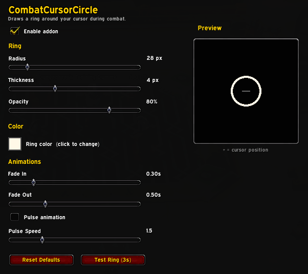

# CombatCursorCircle



A World of Warcraft addon that draws a customizable ring around your cursor during combat. Zero CPU cost outside of combat.

Compatible with WoW 12.0 Midnight (Interface 120000/120001).

## Features

- Ring appears automatically when you enter combat and fades out when you leave
- Smooth fade-in/fade-out animations
- Optional pulse animation (sine-wave alpha oscillation)
- Settings panel in Options > AddOns with live preview
- Minimap addon compartment button (left-click toggle, right-click settings)
- Slash commands for all settings
- Persistent configuration via SavedVariables
- Handles edge cases: login during combat, rapid combat toggling, UI scale changes

## Installation

Copy the `CombatCursorCircle` folder into your WoW addons directory:

```
World of Warcraft/_retail_/Interface/AddOns/CombatCursorCircle/
```

## Configuration

### Settings Panel

Open the settings panel from any of these:

- **Options > AddOns > CombatCursorCircle**
- `/ccc options`
- Right-click the minimap addon compartment button

### Slash Commands

| Command | Description |
|---------|-------------|
| `/ccc options` | Open settings panel |
| `/ccc toggle` | Enable/disable the addon |
| `/ccc radius <10-200>` | Set ring radius in pixels |
| `/ccc color <r> <g> <b>` | Set ring color (0-1 each) |
| `/ccc opacity <0-1>` | Set ring opacity |
| `/ccc thickness <1-10>` | Set line thickness in pixels |
| `/ccc pulse` | Toggle pulse animation |
| `/ccc pulsespeed <0.5-5>` | Set pulse speed |
| `/ccc fadein <0-2>` | Set fade-in duration in seconds |
| `/ccc fadeout <0-2>` | Set fade-out duration in seconds |
| `/ccc test` | Preview ring for 3 seconds |
| `/ccc status` | Print current settings |
| `/ccc reset` | Restore all defaults |

`/combatcursor` also works as an alias for `/ccc`.

## Defaults

| Setting | Default |
|---------|---------|
| Radius | 40 px |
| Thickness | 2 px |
| Color | Red (1.0, 0.2, 0.2) |
| Opacity | 80% |
| Fade In | 0.3s |
| Fade Out | 0.5s |
| Pulse | Off |
| Pulse Speed | 1.5 |

## Technical Details

- Ring is drawn using `CreateLine()` segments arranged in a circle via cos/sin
- Segment count auto-scales with radius for a smooth circle at any size
- Segments overlap slightly at joints with flattened render layers to eliminate gaps
- Cursor position tracked via `OnUpdate` which only fires while the ring frame is shown
- Fade animations use Blizzard `AnimationGroup` (GPU-side, efficient)
- Pulse uses a manual sine-wave on a child frame's `OnUpdate`

## Files

| File | Purpose |
|------|---------|
| `CombatCursorCircle.toc` | Addon metadata |
| `core.lua` | Lifecycle, events, config, slash commands |
| `ring.lua` | Ring rendering, cursor tracking, animations |
| `settings.lua` | Options panel with live preview |
